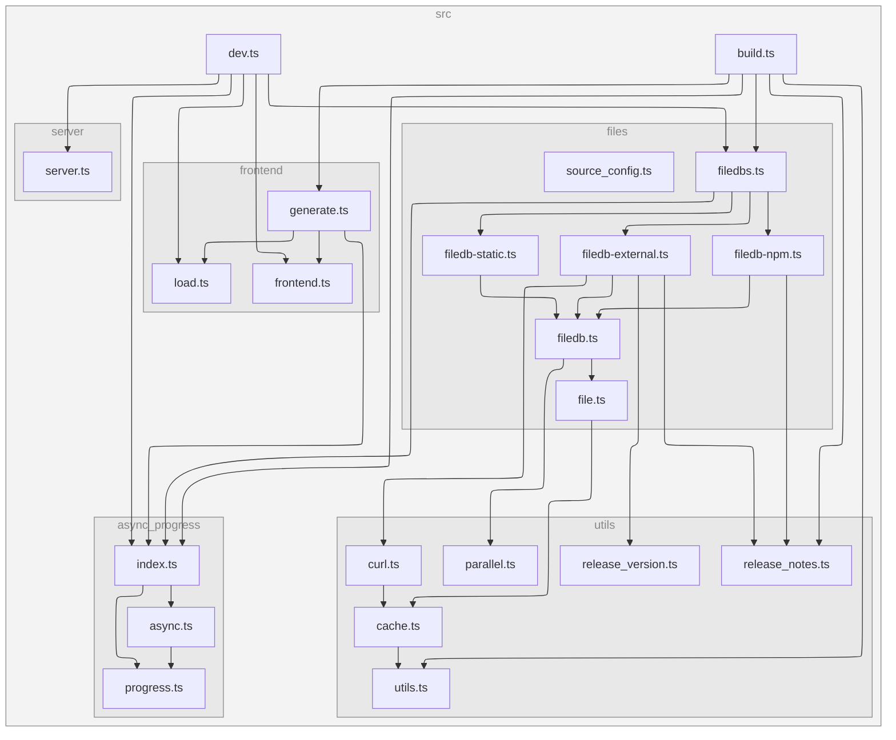

[](https://codecov.io/gh/versatiles-org/versatiles-frontend)
[](https://github.com/versatiles-org/versatiles-frontend/actions/workflows/ci.yml)
[](https://github.com/versatiles-org/versatiles-frontend/releases/latest)
[](https://github.com/versatiles-org/versatiles-frontend/releases/latest)

# VersaTiles Frontend

VersaTiles Frontend provides pre-packaged web assets to serve interactive maps, compatible with [`versatiles-rs`](https://github.com/versatiles-org/versatiles-rs) or [`node-versatiles-server`](https://github.com/versatiles-org/node-versatiles-server). It follows the [VersaTiles Frontend Specification](https://docs.versatiles.org/compendium/specification_frontend.html)

## Available Frontends

1. Standard Frontend

- Files: `frontend.*`
- Features: Includes all assets (styles, sprites, fonts, libraries) required for a standard map server.
- Assumes: Shortbread tiles are served under `/tiles/osm`.

2. Minimal Frontend

- Files: `frontend-min.*`
- Features: Reduced asset footprint, ideal for limited resources.
- Assumes: Shortbread tiles are served under `/tiles/osm`.

3. Development Frontend

- Files: `frontend-dev.*`
- Features: Includes all assets plus additional tools for development.
- index.html: Lists available map sources.
- preview\.html: Previews individual map sources.

## Download the latest release.

You can [download the packaged frontends as the latest release](https://github.com/versatiles-org/versatiles-frontend/releases/latest/). Packages ending with `*.tar.gz` contain the original web frontend files. Packages ending with `*.br.tar.gz` contain the web frontend files pre-compressed with Brotli for faster serving.

## Improve the frontends

### Clone and Build

Clone the repository, install dependencies and build:

```bash
git clone git@github.com:versatiles-org/versatiles-frontend.git
cd versatiles-frontend
npm install
npm run build
```

This will generate all three frontends: `frontend`, `frontend-dev` and `frontend-min`.

- `frontend*.tar.gz`: Standard gzip-compressed container.
- `frontend*.br.tar.gz`: Precompressed with Brotli for fast serving.

## Use a frontend with `versatiles-rs`

```bash
curl -L "https://github.com/versatiles-org/versatiles-frontend/releases/latest/download/frontend-dev.br.tar.gz" -o ./frontend.br.tar.gz
versatiles serve -s ./frontend.br.tar.gz "osm.versatiles"
```

## Developer Guide

### Run in Developer Mode

Start the development server:

```bash
npm run dev frontend
# or:
# npm run dev frontend-min
# npm run dev frontend-dev
```

Features:

- Serves at <http://localhost:8080/>.
- Proxies tile requests to tiles.versatiles.org.
- Watches for file changes and auto-rebuilds.
- You can also use a local tile server from a different local port by running:

```sh
versatiles serve -p 8081 osm.versatiles overlay.versatiles
# then run this in another shell
npm run dev -- -l 8081 frontend-dev
```

## Project Structure

- **cache/**: Caches requests, compresses files.
- **frontends/**: Contains static files (HTML, CSS, JS).
- **release/**: Packaged frontend files.
- **src/**: TypeScript code for frontend generation and local serving.

### Dependency Graph

<!--- This chapter is generated automatically --->



## Resources

VersaTiles Frontend uses several external resources and libraries, including:

- Fonts from [VersaTiles Fonts](https://github.com/versatiles-org/versatiles-fonts)
- Styles and sprites from [VersaTiles Style](https://github.com/versatiles-org/versatiles-style)
- MapLibre GL JS from [MapLibre GL JS GitHub](https://github.com/maplibre/maplibre-gl-js)
- MapLibre GL Inspect from [MapLibre GL Inspect GitHub](https://github.com/maplibre/maplibre-gl-inspect)
