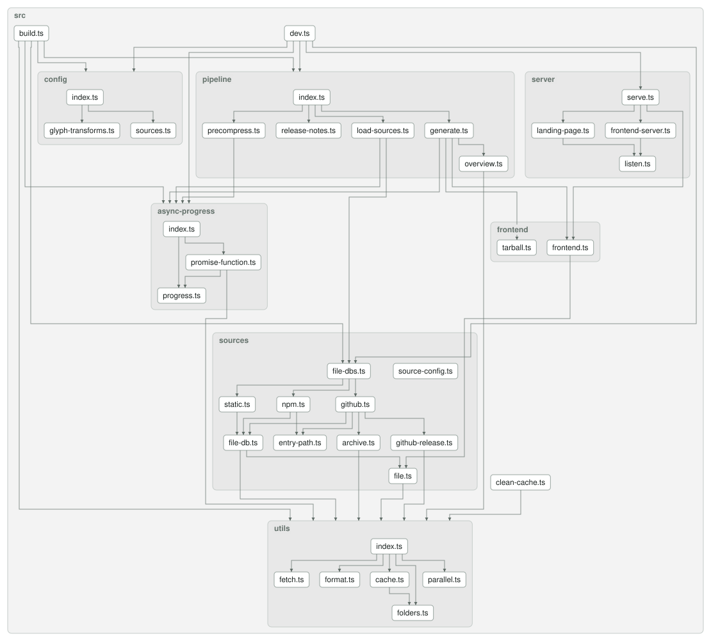

[](https://github.com/versatiles-org/versatiles-frontend/releases/latest)
[](https://github.com/versatiles-org/versatiles-frontend/releases/latest)
[](https://codecov.io/gh/versatiles-org/versatiles-frontend)
[](https://github.com/versatiles-org/versatiles-frontend/actions/workflows/ci.yml)
[](LICENSE)

# VersaTiles Frontend

VersaTiles Frontend provides pre-packaged web assets to serve interactive maps, compatible with [`versatiles-rs`](https://github.com/versatiles-org/versatiles-rs) or [`node-versatiles-server`](https://github.com/versatiles-org/node-versatiles-server). It follows the [VersaTiles Frontend Specification](https://docs.versatiles.org/compendium/specification_frontend.html)

## Available Frontends

- **frontend**: Full standard frontend with all fonts, sprites, and libraries.
- **frontend-dev**: Full standard frontend but with development-specific UI.
- **frontend-min**: Full standard frontend but with only Noto Sans fonts.
- **frontend-blank**: Blank frontend with only fonts and sprites.
- **frontend-tiny**: Minimal frontend with sprites, MapLibre, VersaTiles style and Noto Sans fonts supporting only Latin characters.

`frontend`, `frontend-dev` and `frontend-min` also contain the [VersaTiles Map Editor](https://github.com/versatiles-org/versatiles-map-editor) at `/editor/`, with the viewer of shared maps at `/editor/view/`. It uses the tiles, sprites and fonts of the server it runs on (`/tiles/osm`, and `/tiles/satellite` for the satellite background), see `static/map-editor-config/editor/map-editor.config.jsonc`.

See the [latest release notes](https://github.com/versatiles-org/versatiles-frontend/releases/latest) for details on included components and asset sizes.

## Download the latest release.

You can [download the packaged frontends as the latest release](https://github.com/versatiles-org/versatiles-frontend/releases/latest/). Packages ending with `*.tar.gz` contain the original web frontend files. Packages ending with `*.br.tar.gz` contain the web frontend files pre-compressed with Brotli for faster serving. Packages ending with `*.tar.zst` contain the original files in a much smaller Zstandard-compressed container. All packages store duplicate files as tar hardlinks, which versatiles-rs serves from version 4.14.0 on.

## Improve the frontends

### Clone and Build

Clone the repository, install dependencies and build:

```bash
git clone git@github.com:versatiles-org/versatiles-frontend.git
cd versatiles-frontend
npm install
npm run build
```

This will generate all five frontends: `frontend`, `frontend-dev`, `frontend-min`, `frontend-blank` and `frontend-tiny`.

- `frontend*.tar.gz`: Standard gzip-compressed container.
- `frontend*.br.tar.gz`: Precompressed with Brotli for fast serving.
- `frontend*.tar.zst`: Zstandard-compressed container (level 19).

In all containers, files with the same content as an earlier file are stored as tar hardlinks.

## Use a frontend with `versatiles-rs`

```bash
curl -L "https://github.com/versatiles-org/versatiles-frontend/releases/latest/download/frontend-dev.br.tar.gz" -o ./frontend-dev.br.tar.gz
versatiles serve -s ./frontend-dev.br.tar.gz "osm.versatiles"
```

## Developer Guide

### Run in Developer Mode

Start the development server:

```bash
npm run dev
# or only some frontends:
# npm run dev frontend
# npm run dev frontend frontend-dev
```

Features:

- Serves every frontend on a port of its own, picked by the operating system. An overview page at <http://localhost:8080/> links to them; `-p` sets its port, and the next free one is used if it is taken.
- Listens on `127.0.0.1` only; `--host` changes that.
- Proxies tile requests to tiles.versatiles.org.
- Watches the static sources in `static/` and serves changed files right away, without a restart.
- You can also use a local tile server from a different local port by running:

```sh
versatiles serve -p 8081 osm.versatiles overlay.versatiles
# then run this in another shell
npm run dev -- -l 8081 frontend-dev
```

### Run the Tests

```bash
npm test                  # unit tests
npm run test:e2e          # contents of the bundles in release/ (run `npm run build` first)
npm run test:e2e:browser  # the frontends in a browser, with Playwright (also needs a build)
npm run check             # all of it: formatting, types, lint, the build and all tests
```

Screenshot tests keep snapshots per platform. Update the local ones with `npm run test:e2e:browser:update`, and the Linux ones that CI compares against with `npm run test:e2e:browser:update-linux` (needs Docker).

### Add a Frontend or a Library

Sources and frontends are defined in [`src/config/index.ts`](src/config/index.ts): add a library as a source (`npmSource`, `githubSource` or `staticSource` for a folder in `static/`) and list it in the `fileDBs` of the frontends that should contain it. A new frontend also needs an entry in "Available Frontends" above, which a test checks.

## Project Structure

- **cache/**: Caches requests, compresses files. It is never evicted automatically, so every upstream release leaves the previous version's entries behind. Empty it with `npm run cache:clean` when it has grown too large — the next build refetches and recompresses whatever it needs.
- **docs/**: Images for this README, such as the dependency graph below.
- **e2e/**: Tests of the built bundles in `release/`: their contents, and in `playwright/` the frontends in a browser.
- **release/**: The packaged frontends and their release notes, `notes.md`.
- **scripts/**: Helper scripts, e.g. to update the Playwright screenshots on Linux.
- **static/**: The static sources: files (HTML, CSS, JS, images) of our own, one folder per source.
- **src/**: TypeScript code for frontend generation and local serving. `build.ts`, `dev.ts` and `clean-cache.ts` are the entry points; each folder only uses the ones listed after it:
  - **config/**: defines the sources (static folders, GitHub releases, npm packages) and which of them each frontend contains.
  - **pipeline/**: the steps of the build (loading the sources, compressing, generating the bundles) and the release notes.
  - **server/**: the development server.
  - **frontend/**: a frontend, bundled from the files of its sources.
  - **sources/**: loads the sources into in-memory file databases.
  - **async-progress/**, **utils/**: progress display and general helpers.

### Dependency Graph

<!--- This chapter is generated automatically --->

[](docs/dependency-graph.svg?raw=true)

## Resources

VersaTiles Frontend uses several external resources and libraries, including:

- Fonts from [VersaTiles Fonts](https://github.com/versatiles-org/versatiles-fonts)
- Styles and sprites from [VersaTiles Style](https://github.com/versatiles-org/versatiles-style)
- MapLibre GL JS from [MapLibre GL JS GitHub](https://github.com/maplibre/maplibre-gl-js)
- MapLibre GL Inspect from [MapLibre GL Inspect GitHub](https://github.com/maplibre/maplibre-gl-inspect)
